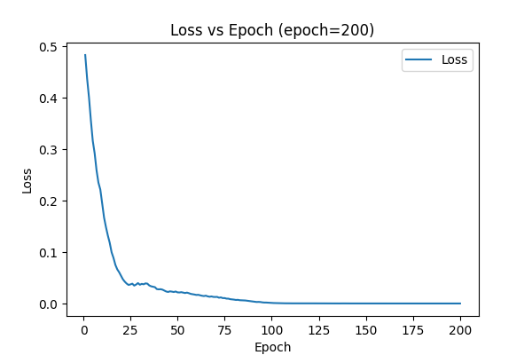
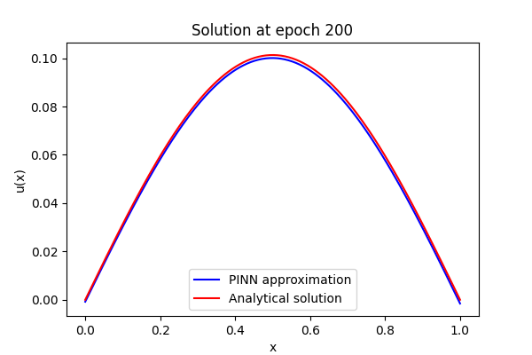

# PINN Poisson 1D Library

This repository contains a Physics-Informed Neural Network (PINN) library for solving the one-dimensional Poisson equation:


$-u''(x) = f(x), \quad x \in [0,1], \quad u(0)=0, \, u(1)=0.$


In particular, we consider \(f(x) = \sin(\pi x)\), whose analytical solution is:


  $u_{true}(x) = \frac{\sin(\pi x)}{\pi^2}.$

The library includes:
- **PINN implementation** (`pinn.py`)
- **Domain generator** (`domain.py`)
- **Equation class** (`equation.py`)
- **Loss functions** (`losses.py`)
- **Event callbacks** (`events.py`), including:
  - Training progress bar
  - Checkpoint saving
  - Loss plotting
  - Solution plotting
  - Relative RMSE printing
  - ONNX export
- **Utilities** (`utils.py`)
- **Configuration** (`config.yaml`)

A Jupyter notebook (`usage_example.ipynb`) demonstrates how to use the library, run training, and visualize results.

## Setup

1. Install Python dependencies:
   ```bash
   pip install torch torchvision matplotlib numpy pyyaml onnx onnxruntime
   ```

2. Ensure the following files are present in the working directory:
   - `pinn.py`
   - `domain.py`
   - `equation.py`
   - `losses.py`
   - `events.py`
   - `utils.py`
   - `run_pinn.py`
   - `config.yaml`
   - `usage_example.ipynb`

## Running the Notebook

Open the Jupyter notebook:
```bash
jupyter notebook usage_example.ipynb
```
Follow the steps to run the training (a shorter demo) and visualize:
- Loss curve: `plots/loss.png`
- Solution plot: `plots/solution/solution_epoch_200.png`
- Final ONNX model: `models/poisson.onnx`

## Example Plots

### Loss Curve


### PINN Solution vs Analytical (Epoch 200)
